[](https://github.com/gongahkia/modo-app/releases/tag/1.0.0)
[](https://github.com/gongahkia/modo-app/releases/tag/2.0.0)

  
> [!WARNING]  
> [`Modo`](https://github.com/gongahkia/modo-app)'s Netlify deployment is inactive as of 30 March 2025.  
  
# `Modo` 🌇 - The social media app for Subcultures

<p align="center">
  
</p>

Modo 2.0.0 is ***now live*** at [modo-live.netlify.app](https://modo-live.netlify.app/).

Created as part of [The Modo Collective](https://github.com/modo-collective/).

## Stack

* [Frontend](./src/modo-app/src/components/) *(Vue.js, Tailwind CSS, Netlify)*
* [Backend](./src/modo-app/src/) *(JavaScript)*
* [DB](./src/modo-app/src/firebase.js) *(Firebase Realtime Database)*
* File server *(ImgBB)*

## Screenshots

### Login/Registration

<div style="display: flex; justify-content: space-between;">
  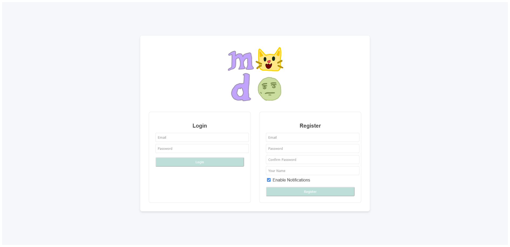
  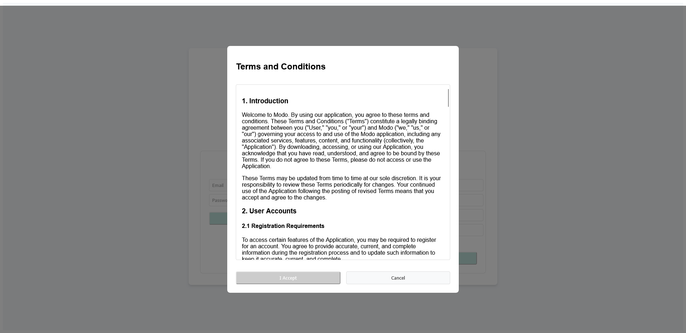
  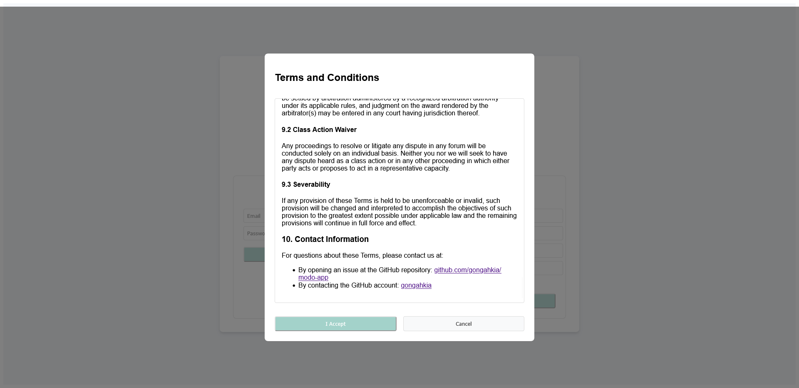
</div>

### Dashboard

<div style="display: flex; justify-content: space-between;">
  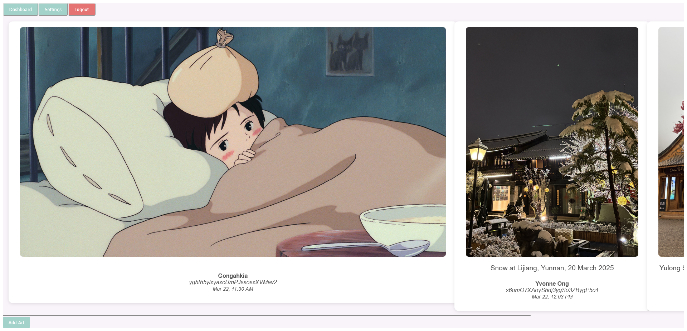
  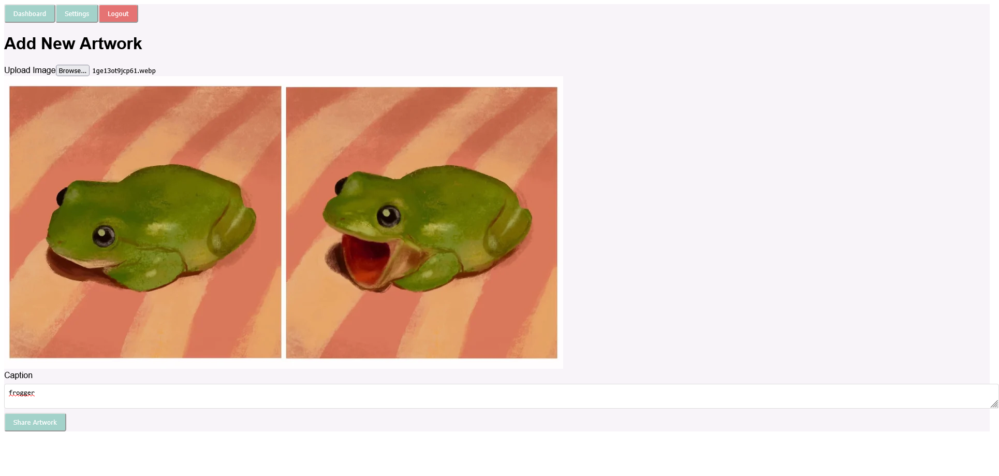
</div>

<div style="display: flex; justify-content: space-between;">
  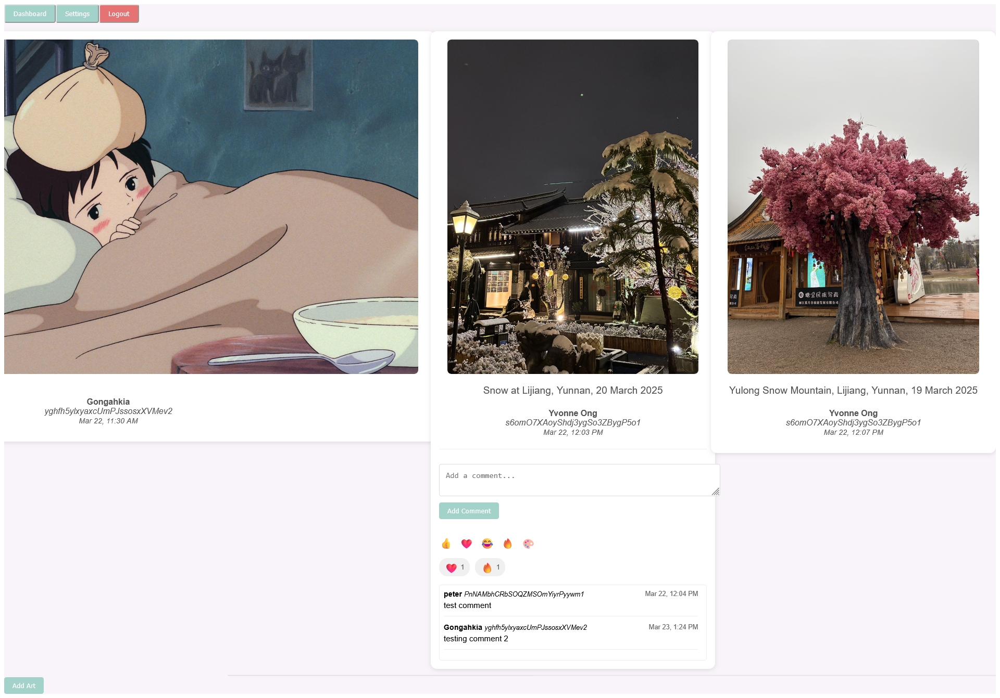
  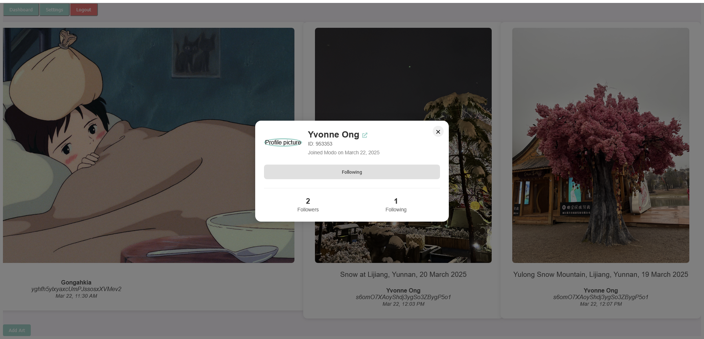
</div>

### Settings

<div style="display: flex; justify-content: space-between;">
  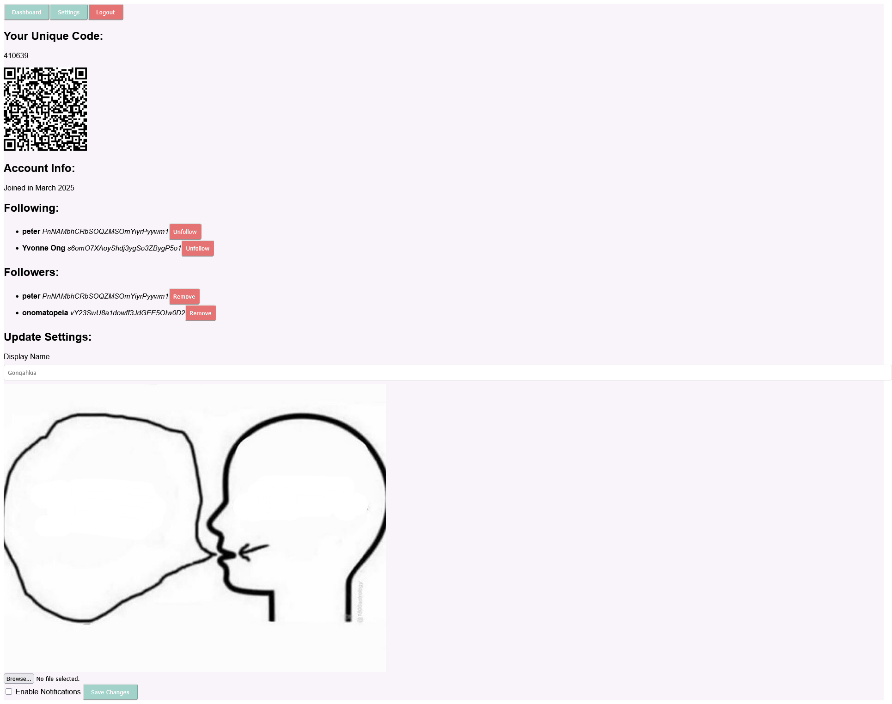
  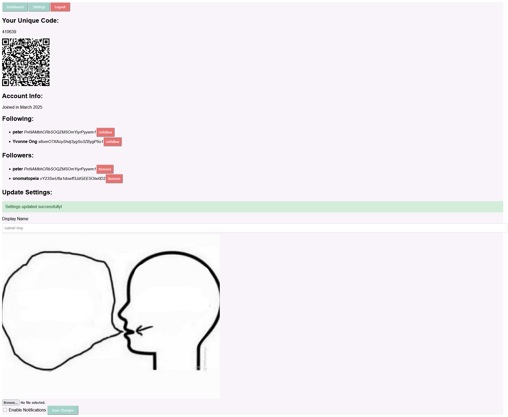
</div>

### QR accessibility

<div style="display: flex; justify-content: space-between;">
  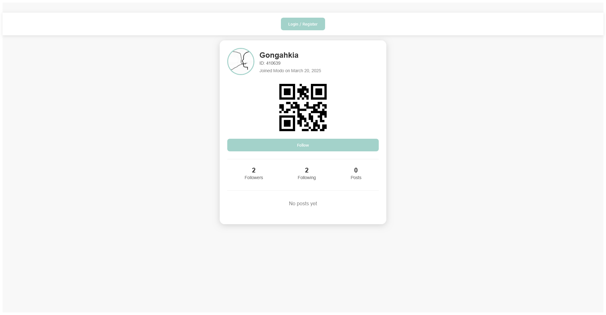
  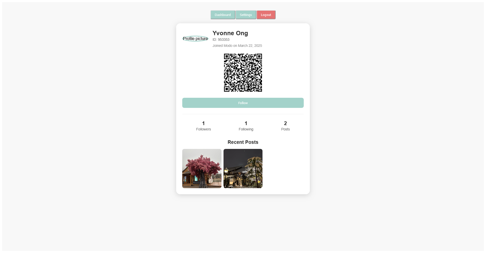
  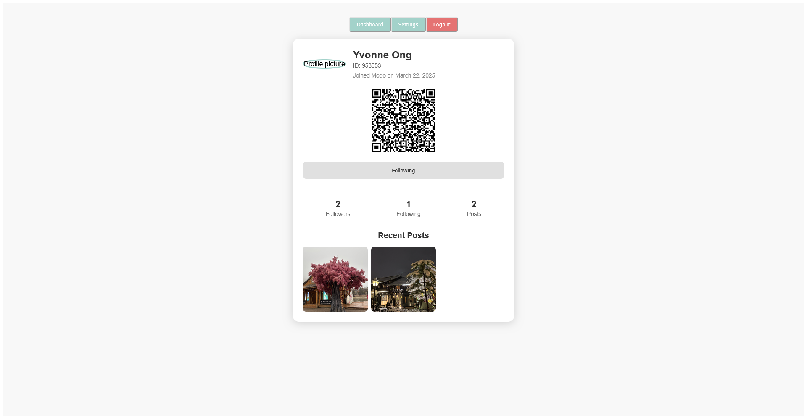
</div>

## Architecture

### Overview


```mermaid
sequenceDiagram
    %% Define participants with styling
    actor User as User
    participant VueApp as Vue.js Frontend
    participant VueStore as Vuex Store
    participant FireAuth as Firebase Auth
    participant FireDB as Firebase Database
    participant ImgBB as ImgBB API
    participant QRService as QR Code Service

    %% Add styling
    rect rgb(240, 248, 255)
    note over User,QRService: User Authentication Flow
    
    %% Authentication process
    User->>+VueApp: Open Application
    VueApp->>+VueStore: Check Authentication State
    VueStore->>+FireAuth: Get Current User
    FireAuth-->>-VueStore: Return User (null)
    VueStore-->>-VueApp: Not Authenticated
    VueApp-->>-User: Display Login Screen
    
    User->>+VueApp: Enter Credentials
    VueApp->>+VueStore: Dispatch Login Action
    VueStore->>+FireAuth: signInWithEmailAndPassword()
    FireAuth-->>-VueStore: Authentication Result
    VueStore->>FireDB: Subscribe to User Data
    VueStore-->>-VueApp: Update Auth State
    VueApp-->>-User: Redirect to Feed
    end

    %% Post creation with image
    rect rgb(255, 240, 245)
    note over User,QRService: Post Creation Flow with Image Upload
    
    User->>+VueApp: Create New Post with Image
    VueApp->>+VueApp: Preview Image
    VueApp-->>-User: Show Image Preview
    
    User->>+VueApp: Confirm Post Creation
    VueApp->>+ImgBB: Upload Image File
    ImgBB-->>-VueApp: Return Image URL
    
    VueApp->>+VueStore: Dispatch Create Post Action
    VueStore->>+FireDB: Add Post Document
    FireDB-->>-VueStore: Post Creation Success
    VueStore-->>-VueApp: Update UI
    VueApp-->>-User: Show Success Message
    end
    
    %% Friend request flow
    rect rgb(240, 255, 240)
    note over User,QRService: Friend Request Flow
    
    User->>+VueApp: Send Friend Request to User2
    VueApp->>+VueStore: Dispatch Friend Request Action
    VueStore->>+FireDB: Create Friend Request Document
    FireDB-->>-VueStore: Request Created
    VueStore-->>-VueApp: Update UI
    VueApp-->>-User: Show Request Sent Message
    
    %% Friend request response
    note over User,QRService: User2 checks requests and responds
    User->>+VueApp: Check Friend Requests
    VueApp->>+VueStore: Get Friend Requests
    VueStore->>+FireDB: Query Friend Requests
    FireDB-->>-VueStore: Return Pending Requests
    VueStore-->>-VueApp: Update UI
    VueApp-->>-User: Show Friend Request List
    
    User->>+VueApp: Accept Friend Request
    VueApp->>+VueStore: Dispatch Accept Request Action
    VueStore->>+FireDB: Update Friend Status
    FireDB-->>-VueStore: Status Updated
    VueStore-->>-VueApp: Update Friends List
    VueApp-->>-User: Show Friend Added Message
    end
    
    %% QR Code User Discovery
    rect rgb(230, 230, 250)
    note over User,QRService: QR Code User Discovery Flow
    
    %% Generate QR Code for current user
    User->>+VueApp: Request Personal QR Code
    VueApp->>+VueStore: Get User Profile Data
    VueStore->>+FireDB: Fetch User Profile
    FireDB-->>-VueStore: Return User Data
    VueStore-->>-VueApp: User Profile Data
    VueApp->>+QRService: Generate QR Code with User ID
    QRService-->>-VueApp: Return QR Code Image
    VueApp-->>-User: Display Personal QR Code
    
    %% Scan another user's QR code
    User->>+VueApp: Scan QR Code
    VueApp->>+VueApp: Access Device Camera
    VueApp->>+QRService: Process QR Code Image
    QRService-->>-VueApp: Extract User ID
    VueApp->>+VueStore: Fetch User Profile by ID
    VueStore->>+FireDB: Query User by ID
    FireDB-->>-VueStore: Return User Profile
    VueStore-->>-VueApp: User Profile Data
    VueApp-->>-User: Display User Profile
    
    %% Add user from QR code
    User->>+VueApp: Send Friend Request to Scanned User
    VueApp->>+VueStore: Dispatch Friend Request Action
    VueStore->>+FireDB: Create Friend Request Document
    FireDB-->>-VueStore: Request Created
    VueStore-->>-VueApp: Update UI
    VueApp-->>-User: Show Request Sent Message
    end
    
    %% User Profile QR Code Sharing
    rect rgb(255, 248, 220)
    note over User,QRService: QR Code Sharing Flow
    
    User->>+VueApp: Share Profile QR Code
    VueApp->>+ImgBB: Upload QR Code Image
    ImgBB-->>-VueApp: Return QR Code URL
    VueApp->>+VueStore: Create Shareable Link
    VueStore->>+FireDB: Store Shareable Link
    FireDB-->>-VueStore: Link Created
    VueStore-->>-VueApp: Return Shareable Link
    VueApp-->>-User: Display Sharing Options
    
    User->>+VueApp: Share Link via Platform
    VueApp->>+VueApp: Open Native Sharing Dialog
    VueApp-->>-User: Confirm Link Shared
    
    note over User,QRService: Another User Opens Shared Link
    User->>+VueApp: Open Shared QR Code Link
    VueApp->>+VueStore: Resolve Link to User ID
    VueStore->>+FireDB: Query User by ID
    FireDB-->>-VueStore: Return User Profile
    VueStore-->>-VueApp: User Profile Data
    VueApp-->>-User: Display User Profile with Connect Option
    end
```

### DB

The Firebase Realtime Database is structured per the below schema.

#### Diagram

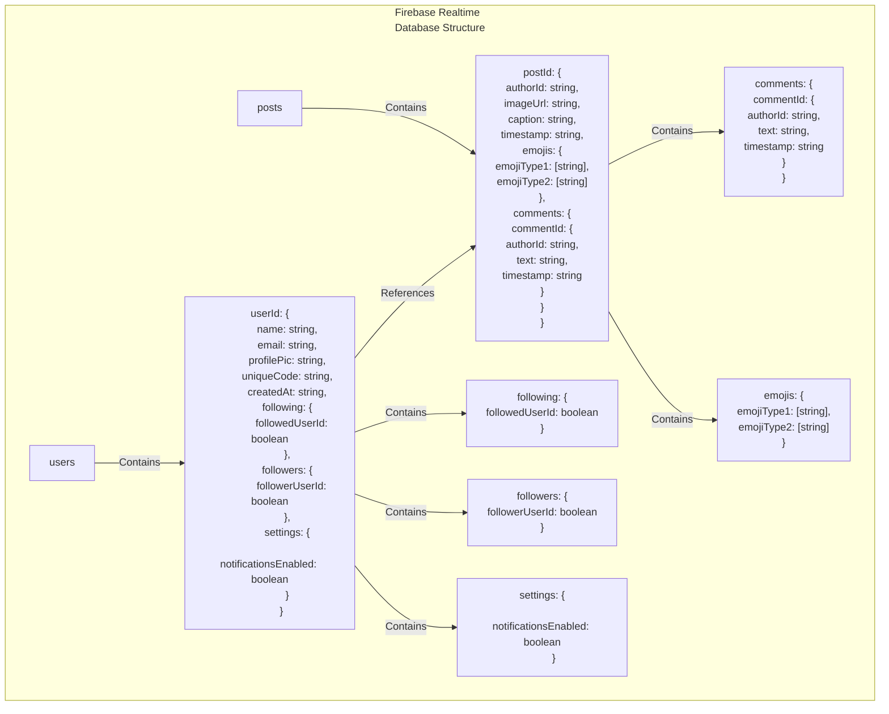
```mermaid
flowchart 

    subgraph "Firebase Realtime <br> Database Structure"

        Users["users"]
        Posts["posts"]
        
        Users -->|Contains| UserData["userId: {
            name: string,
            email: string,
            profilePic: string,
            uniqueCode: string,
            createdAt: string,
            following: {
                followedUserId: boolean
            },
            followers: {
                followerUserId: boolean
            },
            settings: {
                notificationsEnabled: boolean
            }
        }"]
        
        Posts -->|Contains| PostData["postId: {
            authorId: string,
            imageUrl: string,
            caption: string,
            timestamp: string,
            emojis: {
                emojiType1: [string],
                emojiType2: [string]
            },
            comments: {
                commentId: {
                    authorId: string,
                    text: string,
                    timestamp: string
                }
            }
        }"]
        
        UserData -->|References| PostData
        PostData -->|Contains| Comments["comments: {
            commentId: {
                authorId: string,
                text: string,
                timestamp: string
            }
        }"]
        
        PostData -->|Contains| Emojis["emojis: {
            emojiType1: [string],
            emojiType2: [string]
        }"]
        
        UserData -->|Contains| Following["following: {
            followedUserId: boolean
        }"]
        
        UserData -->|Contains| Followers["followers: {
            followerUserId: boolean
        }"]
        
        UserData -->|Contains| Settings["settings: {
            notificationsEnabled: boolean
        }"]
        
    end
```

#### JSON 

```json
{
  "users": {
    "userId": {
      "name": "string",
      "email": "string",
      "profilePic": "string",
      "uniqueCode": "string", 
      "createdAt": "string",
      "following": {
        "followedUserId": "boolean",
      },
      "followers": {
        "followerUserId": "boolean",
      },
      "settings": {
        "notificationsEnabled": "boolean",
      },
    }
  },
  "posts": {
    "postId": {
      "authorId": "string",
      "imageUrl": "string",
      "caption": "string", 
      "timestamp": "string",
      "emojis": {
        "emojiType1": ["string"], 
        "emojiType2": ["string"],
      },
      "comments": {
        "commentId": {
          "authorId": "string",
          "text": "string",
          "timestamp": "string",
        }
      },
    }
  }
}
```

### Details

#### `AddArtPage.vue`

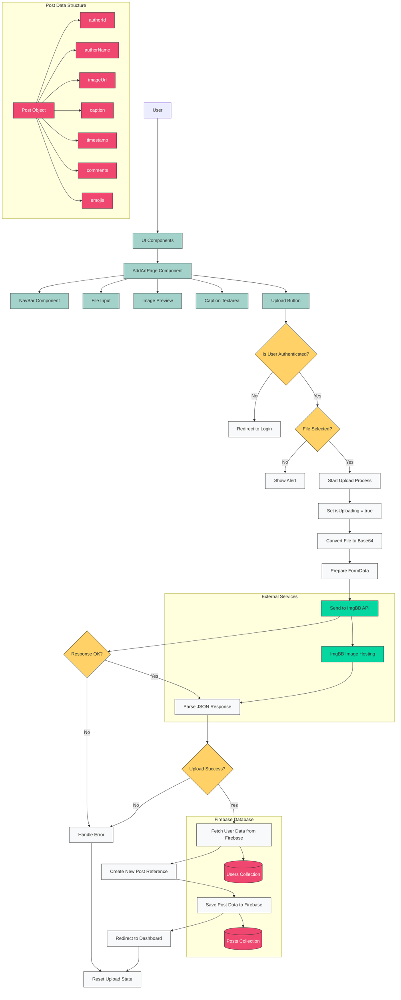
```mermaid
graph TD
    %% Main Components
    User[User] --> UI[UI Components]
    UI --> AddArtPage[AddArtPage Component]
    
    %% UI Components
    AddArtPage --> NavBar[NavBar Component]
    AddArtPage --> FileInput[File Input]
    AddArtPage --> ImagePreview[Image Preview]
    AddArtPage --> CaptionInput[Caption Textarea]
    AddArtPage --> UploadButton[Upload Button]
    
    %% Authentication Flow
    UploadButton --> AuthCheck{Is User Authenticated?}
    AuthCheck -->|No| RedirectLogin[Redirect to Login]
    AuthCheck -->|Yes| FileCheck{File Selected?}
    FileCheck -->|No| ShowAlert[Show Alert]
    FileCheck -->|Yes| StartUpload[Start Upload Process]
    
    %% Upload Process
    StartUpload --> SetUploading[Set isUploading = true]
    SetUploading --> ConvertBase64[Convert File to Base64]
    ConvertBase64 --> PrepareFormData[Prepare FormData]
    PrepareFormData --> ImgBBAPI[Send to ImgBB API]
    ImgBBAPI --> CheckResponse{Response OK?}
    
    %% Error Handling
    CheckResponse -->|No| HandleError[Handle Error]
    HandleError --> ResetUpload[Reset Upload State]
    
    %% Success Path
    CheckResponse -->|Yes| ParseResponse[Parse JSON Response]
    ParseResponse --> CheckSuccess{Upload Success?}
    CheckSuccess -->|No| HandleError
    
    %% Firebase Integration
    CheckSuccess -->|Yes| FetchUserData[Fetch User Data from Firebase]
    FetchUserData --> CreatePostRef[Create New Post Reference]
    CreatePostRef --> SavePostData[Save Post Data to Firebase]
    SavePostData --> RedirectDashboard[Redirect to Dashboard]
    RedirectDashboard --> ResetUpload
    
    %% Data Structure
    subgraph "Firebase Database"
        Users[(Users Collection)]
        Posts[(Posts Collection)]
        FetchUserData --> Users
        SavePostData --> Posts
    end
    
    %% Post Data Structure
    subgraph "Post Data Structure"
        PostData[Post Object]
        PostData --> AuthorId[authorId]
        PostData --> AuthorName[authorName]
        PostData --> ImageUrl[imageUrl]
        PostData --> Caption[caption]
        PostData --> Timestamp[timestamp]
        PostData --> Comments[comments]
        PostData --> Emojis[emojis]
    end
    
    %% External Services
    subgraph "External Services"
        ImgBBService[ImgBB Image Hosting]
        ImgBBAPI --> ImgBBService
        ImgBBService --> ParseResponse
    end
    
    %% Styling
    classDef component fill:#a3d2ca,stroke:#333,stroke-width:1px;
    classDef process fill:#f8f9fa,stroke:#333,stroke-width:1px;
    classDef decision fill:#ffd166,stroke:#333,stroke-width:1px;
    classDef database fill:#ef476f,stroke:#333,stroke-width:1px,color:white;
    classDef external fill:#06d6a0,stroke:#333,stroke-width:1px;
    
    class UI,AddArtPage,NavBar,FileInput,ImagePreview,CaptionInput,UploadButton component;
    class StartUpload,SetUploading,ConvertBase64,PrepareFormData,ParseResponse,FetchUserData,CreatePostRef,SavePostData,RedirectDashboard,ResetUpload,ShowAlert,RedirectLogin,HandleError process;
    class AuthCheck,FileCheck,CheckResponse,CheckSuccess decision;
    class Users,Posts,PostData,AuthorId,AuthorName,ImageUrl,Caption,Timestamp,Comments,Emojis database;
    class ImgBBService,ImgBBAPI external;
```

#### `AuthPage.vue`


```mermaid
graph TD
    %% Main Components
    User[User] --> AuthPage[AuthPage Component]
    
    %% UI Components
    AuthPage --> Logo[Logo Display]
    AuthPage --> StatusMessage[Status Message]
    AuthPage --> LoginCard[Login Card]
    AuthPage --> RegisterCard[Registration Card]
    AuthPage --> TermsModal[Terms and Conditions Modal]
    
    %% Login Flow
    LoginCard --> LoginForm[Login Form]
    LoginForm --> LoginEmail[Email Input]
    LoginForm --> LoginPassword[Password Input]
    LoginForm --> LoginButton[Login Button]
    LoginButton --> HandleLogin[handleLogin Method]
    
    %% Login Process
    HandleLogin --> FirebaseAuth[Firebase Authentication]
    FirebaseAuth -->|Success| ShowSuccessMessage[Show Success Message]
    FirebaseAuth -->|Failure| ShowErrorMessage[Show Error Message]
    ShowSuccessMessage --> RedirectDashboard[Redirect to Dashboard]
    
    %% Registration Flow
    RegisterCard --> RegisterForm[Registration Form]
    RegisterForm --> RegisterEmail[Email Input]
    RegisterForm --> RegisterPassword[Password Input]
    RegisterForm --> ConfirmPassword[Confirm Password Input]
    RegisterForm --> NameInput[Name Input]
    RegisterForm --> NotificationsCheckbox[Notifications Checkbox]
    RegisterForm --> RegisterButton[Register Button]
    RegisterButton --> HandleRegister[handleRegister Method]
    
    %% Password Validation
    HandleRegister --> PasswordCheck{Passwords Match?}
    PasswordCheck -->|No| ShowPasswordError[Show Password Error]
    PasswordCheck -->|Yes| ShowTermsModal[Show Terms Modal]
    
    %% Terms Modal Flow
    TermsModal --> TermsContent[Terms Content]
    TermsContent --> ScrollCheck[Scroll Event Listener]
    ScrollCheck --> CheckScrollMethod[checkScroll Method]
    CheckScrollMethod --> IsBottomCheck{Scrolled to Bottom?}
    IsBottomCheck -->|Yes| EnableAcceptButton[Enable Accept Button]
    IsBottomCheck -->|No| DisableAcceptButton[Disable Accept Button]
    
    %% Terms Actions
    TermsModal --> AcceptButton[Accept Button]
    TermsModal --> CancelButton[Cancel Button]
    AcceptButton --> AcceptTermsMethod[acceptTermsAndRegister Method]
    CancelButton --> CloseTermsModal[closeTermsModal Method]
    AcceptTermsMethod --> CompleteRegistration[completeRegistration Method]
    
    %% Registration Process
    CompleteRegistration --> CreateUserFirebase[Create User in Firebase Auth]
    CreateUserFirebase -->|Success| GenerateUniqueId[Generate Unique ID]
    CreateUserFirebase -->|Failure| ShowRegisterError[Show Registration Error]
    GenerateUniqueId --> SaveUserData[Save User Data to Firebase DB]
    
    %% User Data Structure
    SaveUserData --> UserObject[User Object in Database]
    UserObject --> UserName[name]
    UserObject --> UserEmail[email]
    UserObject --> ProfilePic[profilePic]
    UserObject --> UniqueCode[uniqueCode]
    UserObject --> Following[following]
    UserObject --> Blacklist[blacklist]
    UserObject --> Settings[settings]
    UserObject --> CreatedAt[createdAt]
    
    %% Settings Structure
    Settings --> NotificationsEnabled[notificationsEnabled]
    
    %% Final Actions
    SaveUserData -->|Success| ShowRegisterSuccess[Show Success Message]
    SaveUserData -->|Failure| ShowDatabaseError[Show Database Error]
    ShowRegisterSuccess --> RedirectToDashboard[Redirect to Dashboard]
    
    %% Status Message Handling
    ShowSuccessMessage --> StatusMessageTimeout[Auto-hide after 3 seconds]
    ShowErrorMessage --> StatusMessageTimeout
    ShowPasswordError --> StatusMessageTimeout
    ShowRegisterError --> StatusMessageTimeout
    ShowRegisterSuccess --> StatusMessageTimeout
    ShowDatabaseError --> StatusMessageTimeout
    
    %% Firebase Dependencies
    subgraph "Firebase Services"
        FirebaseAuth
        FirebaseDB[Firebase Realtime Database]
        SaveUserData --> FirebaseDB
    end
    
    %% Styling
    classDef component fill:#a3d2ca,stroke:#333,stroke-width:1px;
    classDef form fill:#f5f7fa,stroke:#333,stroke-width:1px;
    classDef input fill:#ffffff,stroke:#ddd,stroke-width:1px;
    classDef button fill:#a3d2ca,stroke:#333,stroke-width:1px,color:white;
    classDef process fill:#f8f9fa,stroke:#333,stroke-width:1px;
    classDef decision fill:#ffd166,stroke:#333,stroke-width:1px;
    classDef firebase fill:#ffca28,stroke:#333,stroke-width:1px;
    classDef success fill:#d4edda,stroke:#155724,stroke-width:1px,color:#155724;
    classDef error fill:#f8d7da,stroke:#721c24,stroke-width:1px,color:#721c24;
    
    class AuthPage,Logo,StatusMessage,LoginCard,RegisterCard,TermsModal component;
    class LoginForm,RegisterForm form;
    class LoginEmail,LoginPassword,RegisterEmail,RegisterPassword,ConfirmPassword,NameInput input;
    class LoginButton,RegisterButton,AcceptButton,CancelButton button;
    class HandleLogin,HandleRegister,CheckScrollMethod,AcceptTermsMethod,CloseTermsModal,CompleteRegistration,GenerateUniqueId,SaveUserData process;
    class PasswordCheck,IsBottomCheck decision;
    class FirebaseAuth,FirebaseDB,CreateUserFirebase firebase;
    class ShowSuccessMessage,ShowRegisterSuccess success;
    class ShowErrorMessage,ShowPasswordError,ShowRegisterError,ShowDatabaseError error;
```

#### `DashboardPage.vue`

```mermaid
graph TD
    %% Main Components
    User[User] --> DashboardPage[DashboardPage Component]
    
    %% Component Structure
    DashboardPage --> NavBar[NavBar Component]
    DashboardPage --> MainContent[Main Content]
    DashboardPage --> Footer[Footer]
    
    %% Main Content
    MainContent --> EmptyState[Empty State]
    MainContent --> CarouselContainer[Carousel Container]
    CarouselContainer --> CarouselTrack[Carousel Track]
    CarouselTrack --> PostCard[PostCard Component]
    MainContent --> ProfileCard[ProfileCard Component]
    
    %% Data Flow
    DashboardPage --> FetchPosts[fetchPosts Method]
    FetchPosts --> FirebaseDB[Firebase Realtime Database]
    FirebaseDB --> PostsData[Posts Data]
    PostsData --> RenderPosts[Render Posts in Carousel]
    
    %% User Interactions
    PostCard --> ToggleDetails[togglePostDetails Method]
    PostCard --> ShowProfile[showUserProfile Method]
    ProfileCard --> CloseProfile[closeUserProfile Method]
    
    %% Navigation
    Footer --> AddArtButton[Add Art Button]
    AddArtButton --> AddArtPage[Navigate to Add Art Page]
    
    %% Conditional Rendering
    DashboardPage --> AuthCheck{User Authenticated?}
    AuthCheck -->|Yes| FetchPosts
    AuthCheck -->|No| RedirectToHome[Redirect to Home Page]
    
    %% Component Communication
    PostCard -->|@toggle-details| ToggleDetails
    PostCard -->|@show-profile| ShowProfile
    ProfileCard -->|@close| CloseProfile
    
    %% Styling
    DashboardPage --> ScopedStyles[Scoped Styles]
    ScopedStyles --> CarouselStyling[Carousel Styling]
    ScopedStyles --> ButtonStyling[Button Styling]
    ScopedStyles --> ScrollbarStyling[Scrollbar Styling]
    
    %% Lifecycle Hooks
    DashboardPage --> MountedHook[Mounted Hook]
    MountedHook --> AuthCheck
    
    %% Data Properties
    DashboardPage --> DataProperties[Data Properties]
    DataProperties --> PostsArray[posts Array]
    DataProperties --> SelectedPost[selectedPost]
    DataProperties --> SelectedUserId[selectedUserId]
    DataProperties --> IsProfileVisible[isProfileVisible]
    
    %% Methods
    DashboardPage --> ComponentMethods[Component Methods]
    ComponentMethods --> FetchPosts
    ComponentMethods --> ToggleDetails
    ComponentMethods --> ShowProfile
    ComponentMethods --> CloseProfile
    
    %% External Dependencies
    DashboardPage --> FirebaseImports[Firebase Imports]
    FirebaseImports --> RefImport[ref Import]
    FirebaseImports --> OnValueImport[onValue Import]
    FirebaseImports --> AuthImport[auth Import]
    FirebaseImports --> DBImport[db Import]
    
    %% Child Components
    DashboardPage --> ChildComponents[Child Components]
    ChildComponents --> NavBarImport[NavBar Import]
    ChildComponents --> PostCardImport[PostCard Import]
    ChildComponents --> ProfileCardImport[ProfileCard Import]
    
    %% Styling
    classDef component fill:#a3d2ca,stroke:#333,stroke-width:1px;
    classDef data fill:#f5f7fa,stroke:#333,stroke-width:1px;
    classDef method fill:#f8f9fa,stroke:#333,stroke-width:1px;
    classDef external fill:#ffca28,stroke:#333,stroke-width:1px;
    classDef conditional fill:#ffd166,stroke:#333,stroke-width:1px;
    
    class DashboardPage,NavBar,MainContent,Footer,CarouselContainer,PostCard,ProfileCard component;
    class PostsData,DataProperties data;
    class FetchPosts,ToggleDetails,ShowProfile,CloseProfile,ComponentMethods method;
    class FirebaseDB,FirebaseImports external;
    class AuthCheck conditional;
```

#### `NavBar.vue`

```mermaid
graph TD
    %% Main Component
    User[User] --> NavBar[NavBar Component]
    
    %% Component Structure
    NavBar --> NavigationLinks[Navigation Links]
    NavBar --> StatusMessage[Status Message]
    
    %% Navigation Links
    NavigationLinks --> DashboardButton[Dashboard Button]
    NavigationLinks --> SettingsButton[Settings Button]
    NavigationLinks --> LogoutButton[Logout Button]
    
    %% Button Actions
    DashboardButton -->|@click| RouterPushDashboard[Router Push to /dashboard]
    SettingsButton -->|@click| RouterPushSettings[Router Push to /settings]
    LogoutButton -->|@click| LogoutMethod[logout Method]
    
    %% Logout Process
    LogoutMethod --> FirebaseAuth[Firebase Auth]
    FirebaseAuth -->|signOut| LogoutSuccess{Logout Successful?}
    
    %% Logout Outcomes
    LogoutSuccess -->|Yes| SuccessMessage[Show Success Message]
    LogoutSuccess -->|No| ErrorMessage[Show Error Message]
    SuccessMessage --> RedirectHome[Redirect to Home Page]
    
    %% Status Message Handling
    SuccessMessage --> ShowStatusMethod[showStatusMessage Method]
    ErrorMessage --> ShowStatusMethod
    ShowStatusMethod --> SetMessage[Set statusMessage]
    ShowStatusMethod --> SetIsSuccess[Set isSuccess flag]
    ShowStatusMethod --> SetTimeout[Set Timeout]
    SetTimeout -->|After 3s| ClearMessage[Clear statusMessage]
    
    %% Conditional Rendering
    NavBar --> StatusMessageCheck{statusMessage exists?}
    StatusMessageCheck -->|Yes| RenderStatusMessage[Render Status Message]
    StatusMessageCheck -->|No| HideStatusMessage[Hide Status Message]
    
    %% Status Message Styling
    RenderStatusMessage --> SuccessCheck{isSuccess?}
    SuccessCheck -->|Yes| ApplySuccessStyle[Apply Success Styling]
    SuccessCheck -->|No| ApplyErrorStyle[Apply Error Styling]
    
    %% Styling
    NavBar --> ScopedStyles[Scoped Styles]
    ScopedStyles --> ButtonStyles[Button Styles]
    ScopedStyles --> ButtonRedStyles[Button-Red Styles]
    ScopedStyles --> StatusMessageStyles[Status Message Styles]
    
    %% Data Properties
    NavBar --> DataProperties[Data Properties]
    DataProperties --> StatusMessageProp[statusMessage]
    DataProperties --> IsSuccessProp[isSuccess]
    
    %% External Dependencies
    NavBar --> FirebaseImport[Firebase Auth Import]
    
    %% Styling Classes
    classDef component fill:#a3d2ca,stroke:#333,stroke-width:1px;
    classDef ui fill:#f5f7fa,stroke:#333,stroke-width:1px;
    classDef method fill:#f8f9fa,stroke:#333,stroke-width:1px;
    classDef external fill:#ffca28,stroke:#333,stroke-width:1px;
    classDef conditional fill:#ffd166,stroke:#333,stroke-width:1px;
    classDef action fill:#06d6a0,stroke:#333,stroke-width:1px;
    
    class NavBar,NavigationLinks,StatusMessage component;
    class DashboardButton,SettingsButton,LogoutButton,RenderStatusMessage ui;
    class LogoutMethod,ShowStatusMethod,SetMessage,SetIsSuccess,SetTimeout,ClearMessage method;
    class FirebaseAuth,FirebaseImport external;
    class LogoutSuccess,StatusMessageCheck,SuccessCheck conditional;
    class RouterPushDashboard,RouterPushSettings,RedirectHome action;
```

#### `PostCard.vue`

```mermaid
graph TD
    %% Main Component
    User[User] --> PostCard[PostCard Component]
    
    %% Component Structure
    PostCard --> ImageSection[Image Section]
    PostCard --> CaptionSection[Caption Section]
    PostCard --> AuthorSection[Author Section]
    PostCard --> PostDetails[Post Details Section]
    
    %% Image Section
    ImageSection --> PostImage[Post Image]
    PostImage -->|@click| ToggleDetails[togglePostDetails Method]
    
    %% Caption Section
    CaptionSection --> CaptionText[Caption Text]
    
    %% Author Section
    AuthorSection --> AuthorName[Author Name]
    AuthorSection --> AuthorID[Author ID]
    AuthorSection --> PostTime[Post Timestamp]
    AuthorName -->|@click| ShowProfile[showUserProfile Method]
    
    %% Post Details (Conditional)
    PostDetails -->CommentInput[Comment Input]
    PostDetails --> EmojiSection[Emoji Section]
    PostDetails --> EmojiContainer[Emoji Container]
    PostDetails --> CommentsContainer[Comments Container]
    
    %% Comment Input
    CommentInput --> CommentTextarea[Comment Textarea]
    CommentInput --> AddCommentButton[Add Comment Button]
    AddCommentButton -->|@click| AddComment[addComment Method]
    
    %% Emoji Section
    EmojiSection --> EmojiList[Available Emojis]
    EmojiList -->|@click| AddEmoji[addEmoji Method]
    
    %% Emoji Container
    EmojiContainer --> EmojiCounts[Emoji Counts]
    
    %% Comments Container
    CommentsContainer --> NoCommentsMessage[No Comments Message]
    CommentsContainer --> CommentsList[Comments List]
    CommentsList --> CommentItems[Comment Items]
    CommentItems --> CommentHeader[Comment Header]
    CommentItems --> CommentText[Comment Text]
    CommentHeader --> CommentAuthor[Comment Author]
    CommentHeader --> CommentTime[Comment Time]
    CommentAuthor -->|@click| ShowProfile
    
    %% Data Flow - Add Comment
    AddComment --> FetchUserData[Fetch User Data]
    FetchUserData --> CreateCommentRef[Create Comment Reference]
    CreateCommentRef --> GenerateCommentKey[Generate Comment Key]
    GenerateCommentKey --> PrepareCommentData[Prepare Comment Data]
    PrepareCommentData --> UpdateDatabase[Update Firebase Database]
    UpdateDatabase --> ClearCommentInput[Clear Comment Input]
    ClearCommentInput --> ScrollToLatest[Scroll to Latest Comment]
    
    %% Data Flow - Add Emoji
    AddEmoji --> FetchCurrentEmojis[Fetch Current Emoji Users]
    FetchCurrentEmojis --> CheckUserExists{User Already Added?}
    CheckUserExists -->|No| AddUserToEmoji[Add User to Emoji List]
    AddUserToEmoji --> UpdateEmojiData[Update Emoji Data in Firebase]
    
    %% Props and Emits
    PostCard -->|Props| ReceivePostData[Receive Post Data]
    PostCard -->|Props| ReceiveIsSelected[Receive isSelected Flag]
    ToggleDetails -->|$emit| EmitToggleDetails[Emit toggle-details Event]
    ShowProfile -->|$emit| EmitShowProfile[Emit show-profile Event]
    
    %% Lifecycle Hooks
    PostCard --> UpdatedHook[updated Lifecycle Hook]
    UpdatedHook --> CheckCommentsExist{Comments Exist?}
    CheckCommentsExist -->|Yes| ScrollToLatest
    
    %% Helper Methods
    PostCard --> FormatTimestamp[formatTimestamp Method]
    FormatTimestamp --> CheckValidDate{Valid Date?}
    CheckValidDate -->|Yes| CompareYear{Current Year?}
    CompareYear -->|Yes| FormatWithoutYear[Format Without Year]
    CompareYear -->|No| FormatWithYear[Format With Year]
    
    %% Firebase Integration
    PostCard --> FirebaseImports[Firebase Imports]
    FirebaseImports --> RefImport[ref Import]
    FirebaseImports --> UpdateImport[update Import]
    FirebaseImports --> PushImport[push Import]
    FirebaseImports --> GetImport[get Import]
    FirebaseImports --> OnValueImport[onValue Import]
    
    %% Styling
    classDef component fill:#a3d2ca,stroke:#333,stroke-width:1px;
    classDef section fill:#f5f7fa,stroke:#333,stroke-width:1px;
    classDef method fill:#f8f9fa,stroke:#333,stroke-width:1px;
    classDef firebase fill:#ffca28,stroke:#333,stroke-width:1px;
    classDef conditional fill:#ffd166,stroke:#333,stroke-width:1px;
    
    class PostCard component;
    class ImageSection,CaptionSection,AuthorSection,PostDetails,CommentInput,EmojiSection,EmojiContainer,CommentsContainer section;
    class ToggleDetails,AddComment,AddEmoji,ShowProfile,FormatTimestamp,ScrollToLatest method;
    class FirebaseImports,UpdateDatabase,FetchUserData,FetchCurrentEmojis,UpdateEmojiData firebase;
    class CheckUserExists,CheckCommentsExist,CheckValidDate,CompareYear conditional;
```

#### `ProfileCard.vue`

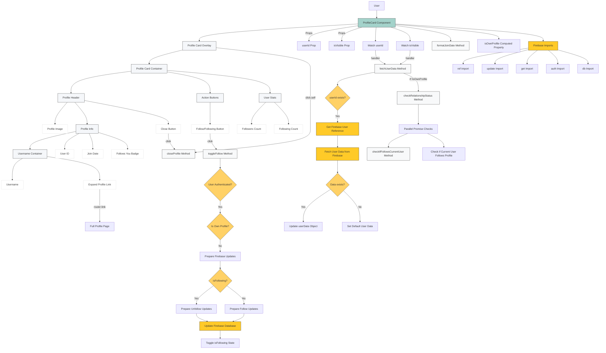
```mermaid
graph TD
    %% Main Component
    User[User] --> ProfileCard[ProfileCard Component]
    
    %% Component Structure
    ProfileCard --> ProfileCardOverlay[Profile Card Overlay]
    ProfileCardOverlay --> ProfileCardContainer[Profile Card Container]
    
    %% Profile Card Sections
    ProfileCardContainer --> ProfileHeader[Profile Header]
    ProfileCardContainer --> ActionButtons[Action Buttons]
    ProfileCardContainer --> UserStats[User Stats]
    
    %% Profile Header Elements
    ProfileHeader --> ProfileImage[Profile Image]
    ProfileHeader --> ProfileInfo[Profile Info]
    ProfileHeader --> CloseButton[Close Button]
    
    %% Profile Info Elements
    ProfileInfo --> UsernameContainer[Username Container]
    ProfileInfo --> UserID[User ID]
    ProfileInfo --> JoinDate[Join Date]
    ProfileInfo --> FollowsYou[Follows You Badge]
    
    %% Username Container Elements
    UsernameContainer --> Username[Username]
    UsernameContainer --> ExpandIcon[Expand Profile Link]
    
    %% Action Buttons (Conditional)
    ActionButtons -->FollowButton[Follow/Following Button]
    
    %% User Stats Elements
    UserStats --> FollowersCount[Followers Count]
    UserStats --> FollowingCount[Following Count]
    
    %% Component Props
    ProfileCard -->|Props| UserIdProp[userId Prop]
    ProfileCard -->|Props| IsVisibleProp[isVisible Prop]
    
    %% User Interactions
    CloseButton -->|click| CloseProfile[closeProfile Method]
    ProfileCardOverlay -->|click.self| CloseProfile
    FollowButton -->|click| ToggleFollow[toggleFollow Method]
    ExpandIcon -->|router-link| FullProfilePage[Full Profile Page]
    
    %% Data Flow
    ProfileCard --> WatchUserId[Watch userId]
    ProfileCard --> WatchIsVisible[Watch isVisible]
    WatchUserId -->|handler| FetchUserData[fetchUserData Method]
    WatchIsVisible -->|handler| FetchUserData
    
    %% Fetch User Data Process
    FetchUserData --> CheckUserId{userId exists?}
    CheckUserId -->|Yes| GetUserRef[Get Firebase User Reference]
    GetUserRef --> FetchFromFirebase[Fetch User Data from Firebase]
    FetchFromFirebase --> CheckDataExists{Data exists?}
    CheckDataExists -->|Yes| UpdateUserData[Update userData Object]
    CheckDataExists -->|No| SetDefaultData[Set Default User Data]
    
    %% Relationship Status Check
    FetchUserData -->|if !isOwnProfile| CheckRelationshipStatus[checkRelationshipStatus Method]
    CheckRelationshipStatus --> ParallelChecks[Parallel Promise Checks]
    ParallelChecks --> CheckFollowsCurrentUser[checkIfFollowsCurrentUser Method]
    ParallelChecks --> CheckIsFollowing[Check if Current User Follows Profile]
    
    %% Toggle Follow Process
    ToggleFollow --> AuthCheck{User Authenticated?}
    AuthCheck -->|Yes| SelfCheck{Is Own Profile?}
    SelfCheck -->|No| PrepareUpdates[Prepare Firebase Updates]
    PrepareUpdates --> IsFollowingCheck{isFollowing?}
    IsFollowingCheck -->|Yes| PrepareUnfollow[Prepare Unfollow Updates]
    IsFollowingCheck -->|No| PrepareFollow[Prepare Follow Updates]
    PrepareUnfollow --> UpdateFirebase[Update Firebase Database]
    PrepareFollow --> UpdateFirebase
    UpdateFirebase --> ToggleFollowingState[Toggle isFollowing State]
    
    %% Helper Methods
    ProfileCard --> FormatJoinDate[formatJoinDate Method]
    
    %% Computed Properties
    ProfileCard --> IsOwnProfile[isOwnProfile Computed Property]
    
    %% Firebase Integration
    ProfileCard --> FirebaseImports[Firebase Imports]
    FirebaseImports --> RefImport[ref Import]
    FirebaseImports --> UpdateImport[update Import]
    FirebaseImports --> GetImport[get Import]
    FirebaseImports --> AuthImport[auth Import]
    FirebaseImports --> DbImport[db Import]
    
    %% Styling
    classDef component fill:#a3d2ca,stroke:#333,stroke-width:1px;
    classDef section fill:#f5f7fa,stroke:#333,stroke-width:1px;
    classDef element fill:#ffffff,stroke:#ddd,stroke-width:1px;
    classDef method fill:#f8f9fa,stroke:#333,stroke-width:1px;
    classDef firebase fill:#ffca28,stroke:#333,stroke-width:1px;
    classDef conditional fill:#ffd166,stroke:#333,stroke-width:1px;
    
    class ProfileCard component;
    class ProfileCardOverlay,ProfileCardContainer,ProfileHeader,ActionButtons,UserStats,ProfileInfo,UsernameContainer section;
    class ProfileImage,Username,UserID,JoinDate,FollowsYou,CloseButton,FollowButton,FollowersCount,FollowingCount,ExpandIcon element;
    class CloseProfile,FetchUserData,CheckRelationshipStatus,ToggleFollow,FormatJoinDate,CheckFollowsCurrentUser method;
    class FirebaseImports,GetUserRef,FetchFromFirebase,UpdateFirebase firebase;
    class CheckUserId,CheckDataExists,AuthCheck,SelfCheck,IsFollowingCheck conditional;
```

#### `SettingsPage.vue`

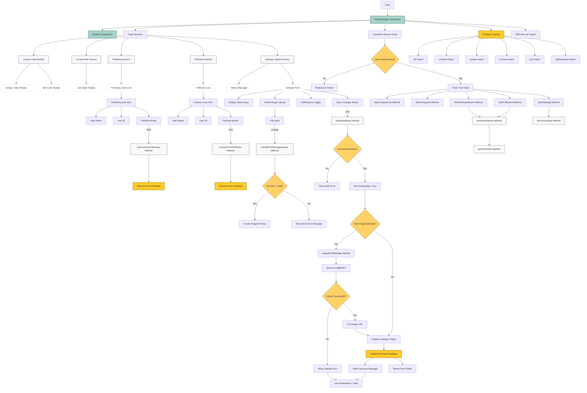
```mermaid
graph TD
    %% Main Component
    User[User] --> SettingsPage[SettingsPage Component]
    
    %% Component Structure
    SettingsPage --> NavBar[NavBar Component]
    SettingsPage --> Sections[Page Sections]
    
    %% Page Sections
    Sections --> UniqueCodeSection[Unique Code Section]
    Sections --> AccountInfoSection[Account Info Section]
    Sections --> FollowingSection[Following Section]
    Sections --> FollowersSection[Followers Section]
    Sections --> SettingsSection[Settings Update Section]
    
    %% Unique Code Section
    UniqueCodeSection --> UniqueCodeDisplay[Unique Code Display]
    UniqueCodeSection --> QRCodeDisplay[QR Code Display]
    
    %% Account Info Section
    AccountInfoSection --> JoinDateDisplay[Join Date Display]
    
    %% Following Section
    FollowingSection --> FollowingList[Following Users List]
    FollowingList --> FollowingUserItem[Following User Item]
    FollowingUserItem --> FollowingUserName[User Name]
    FollowingUserItem --> FollowingUserID[User ID]
    FollowingUserItem --> UnfollowButton[Unfollow Button]
    UnfollowButton -->|click| RemoveFromFollowing[removeFromFollowing Method]
    
    %% Followers Section
    FollowersSection --> FollowersList[Followers List]
    FollowersList --> FollowerUserItem[Follower User Item]
    FollowerUserItem --> FollowerUserName[User Name]
    FollowerUserItem --> FollowerUserID[User ID]
    FollowerUserItem --> RemoveButton[Remove Button]
    RemoveButton -->|click| RemoveFromFollowers[removeFromFollowers Method]
    
    %% Settings Update Section
    SettingsSection --> StatusMessage[Status Message]
    SettingsSection --> SettingsForm[Settings Form]
    SettingsForm --> DisplayNameInput[Display Name Input]
    SettingsForm --> ProfileImageUpload[Profile Image Upload]
    SettingsForm --> NotificationsToggle[Notifications Toggle]
    SettingsForm --> SaveButton[Save Changes Button]
    
    %% Profile Image Upload Flow
    ProfileImageUpload --> FileInput[File Input]
    FileInput -->|change| HandleProfileImageUpload[handleProfileImageUpload Method]
    HandleProfileImageUpload --> FileSizeCheck{File Size < 2MB?}
    FileSizeCheck -->|Yes| CreatePreview[Create Image Preview]
    FileSizeCheck -->|No| ShowSizeError[Show Size Error Message]
    
    %% Save Settings Flow
    SaveButton -->|click| UpdateSettings[updateSettings Method]
    UpdateSettings --> AuthCheck{User Authenticated?}
    AuthCheck -->|No| ShowAuthError[Show Auth Error]
    AuthCheck -->|Yes| SetUploading[Set isUploading = true]
    SetUploading --> CheckForImage{New Image Selected?}
    CheckForImage -->|Yes| UploadProfileImage[uploadProfileImage Method]
    UploadProfileImage --> ImgBBAPI[Send to ImgBB API]
    ImgBBAPI --> ProcessResponse{Upload Successful?}
    ProcessResponse -->|No| ShowUploadError[Show Upload Error]
    ProcessResponse -->|Yes| GetImageURL[Get Image URL]
    CheckForImage -->|No| PrepareUpdates[Prepare Updates Object]
    GetImageURL --> PrepareUpdates
    PrepareUpdates --> UpdateFirebase[Update Firebase Database]
    UpdateFirebase --> ShowSuccess[Show Success Message]
    UpdateFirebase --> ResetForm[Reset Form Fields]
    ShowSuccess --> SetUploadingFalse[Set isUploading = false]
    ShowUploadError --> SetUploadingFalse
    
    %% Data Fetching Methods
    SettingsPage --> MountedHook[mounted Lifecycle Hook]
    MountedHook --> AuthCheckMount{User Authenticated?}
    AuthCheckMount -->|No| RedirectToHome[Redirect to Home]
    AuthCheckMount -->|Yes| FetchData[Fetch User Data]
    FetchData --> FetchUniqueCode[fetchUniqueCode Method]
    FetchData --> FetchUniqueUrl[fetchUniqueUrl Method]
    FetchData --> FetchFollowedUsers[fetchFollowedUsers Method]
    FetchData --> FetchFollowers[fetchFollowers Method]
    FetchData --> FetchSettings[fetchSettings Method]
    
    %% Following/Followers Management
    RemoveFromFollowing --> FirebaseRemove1[Remove from Firebase]
    RemoveFromFollowers --> FirebaseRemove2[Remove from Firebase]
    FetchFollowedUsers --> FetchUserNames[fetchUserNames Method]
    FetchFollowers --> FetchUserNames
    FetchUserNames --> GetUserName[getUserName Method]
    
    %% Helper Methods
    FetchSettings --> FormatJoinDate[formatJoinDate Method]
    
    %% Firebase Integration
    SettingsPage --> FirebaseImports[Firebase Imports]
    FirebaseImports --> RefImport[ref Import]
    FirebaseImports --> OnValueImport[onValue Import]
    FirebaseImports --> UpdateImport[update Import]
    FirebaseImports --> RemoveImport[remove Import]
    FirebaseImports --> GetImport[get Import]
    FirebaseImports --> GetDatabaseImport[getDatabase Import]
    
    %% External Components
    SettingsPage --> QRCodeVueImport[QRCode.vue Import]
    
    %% Styling
    classDef component fill:#a3d2ca,stroke:#333,stroke-width:1px;
    classDef section fill:#f5f7fa,stroke:#333,stroke-width:1px;
    classDef element fill:#ffffff,stroke:#ddd,stroke-width:1px;
    classDef method fill:#f8f9fa,stroke:#333,stroke-width:1px;
    classDef firebase fill:#ffca28,stroke:#333,stroke-width:1px;
    classDef conditional fill:#ffd166,stroke:#333,stroke-width:1px;
    
    class SettingsPage,NavBar component;
    class UniqueCodeSection,AccountInfoSection,FollowingSection,FollowersSection,SettingsSection section;
    class UniqueCodeDisplay,QRCodeDisplay,JoinDateDisplay,FollowingList,FollowersList,StatusMessage,SettingsForm element;
    class RemoveFromFollowing,RemoveFromFollowers,HandleProfileImageUpload,UpdateSettings,FetchUserNames,GetUserName,FormatJoinDate method;
    class FirebaseImports,FirebaseRemove1,FirebaseRemove2,UpdateFirebase firebase;
    class FileSizeCheck,AuthCheck,CheckForImage,ProcessResponse,AuthCheckMount conditional;
```

#### `UserProfilePage.vue`


```mermaid
graph TD
    %% Main Component
    User[User] --> UserProfilePage[UserProfilePage Component]
    
    %% Component Structure
    UserProfilePage --> AuthCheck{Is Authenticated?}
    AuthCheck -->|Yes| NavBar[NavBar Component]
    AuthCheck -->|No| LoginButton[Login/Register Button]
    UserProfilePage --> ProfileContainer[Profile Container]
    
    %% Profile Container Sections
    ProfileContainer --> ProfileHeader[Profile Header]
    ProfileContainer --> QRCodeContainer[QR Code Container]
    ProfileContainer --> ActionButtons[Action Buttons]
    ProfileContainer --> UserStats[User Stats]
    ProfileContainer --> UserPosts[User Posts Section]
    
    %% Profile Header Elements
    ProfileHeader --> ProfileImage[Profile Image]
    ProfileHeader --> ProfileInfo[Profile Info]
    ProfileInfo --> Username[Username Display]
    ProfileInfo --> UserID[User ID Display]
    ProfileInfo --> JoinDate[Join Date Display]
    ProfileInfo --> FollowsYouBadge[Follows You Badge]
    
    %% QR Code Section
    QRCodeContainer --> QRCodeVue[QRCode Vue Component]
    
    %% Action Buttons (Conditional)
    ActionButtons -->FollowButton[Follow/Following Button]
    FollowButton -->|click| ToggleFollow[toggleFollow Method]
    
    %% User Stats Elements
    UserStats --> FollowersCount[Followers Count]
    UserStats --> FollowingCount[Following Count]
    UserStats --> PostCount[Posts Count]
    
    %% User Posts Section
    UserPosts --> PostsCheck{Has Posts?}
    PostsCheck -->|Yes| PostsGrid[Posts Grid]
    PostsCheck -->|No| NoPosts[No Posts Message]
    PostsGrid --> PostThumbnail[Post Thumbnail]
    
    %% Component Lifecycle
    UserProfilePage --> CreatedHook[created Lifecycle Hook]
    CreatedHook --> CheckAuthentication[Check Authentication]
    CreatedHook --> InitialFetchUserData[fetchUserData Method]
    CreatedHook --> InitialFetchUserPosts[fetchUserPosts Method]
    CreatedHook --> InitialCheckRelationship[checkRelationshipStatus Method]
    
    %% Mounted Hook
    UserProfilePage --> MountedHook[mounted Lifecycle Hook]
    MountedHook --> LogUserFound[Log User Found]
    MountedHook --> FetchUniqueUrl[fetchUniqueUrl Method]
    
    %% Data Fetching Methods
    InitialFetchUserData --> UserIDCheck{UserID Exists?}
    UserIDCheck -->|Yes| GetUserRef[Get Firebase User Reference]
    GetUserRef --> FetchFromFirebase[Fetch User Data from Firebase]
    FetchFromFirebase --> UpdateUserData[Update userData Object]
    
    %% Posts Fetching
    InitialFetchUserPosts --> CreatePostsQuery[Create Query for User Posts]
    CreatePostsQuery --> FetchPostsFromFirebase[Fetch Posts from Firebase]
    FetchPostsFromFirebase --> PostsExistCheck{Posts Exist?}
    PostsExistCheck -->|Yes| ProcessPosts[Process and Sort Posts]
    PostsExistCheck -->|No| SetEmptyPosts[Set Empty Posts Array]
    
    %% Relationship Status Check
    InitialCheckRelationship --> IsOwnProfileCheck{Is Own Profile?}
    IsOwnProfileCheck -->|No| ParallelChecks[Run Parallel Checks]
    ParallelChecks --> CheckFollowsCurrentUser[Check if User Follows Current User]
    ParallelChecks --> CheckCurrentUserFollows[Check if Current User Follows User]
    
    %% Toggle Follow Process
    ToggleFollow --> AuthFollowCheck{User Authenticated?}
    AuthFollowCheck -->|Yes| SelfFollowCheck{Is Own Profile?}
    SelfFollowCheck -->|No| PrepareUpdates[Prepare Firebase Updates]
    PrepareUpdates --> IsFollowingCheck{isFollowing?}
    IsFollowingCheck -->|Yes| PrepareUnfollow[Prepare Unfollow Updates]
    IsFollowingCheck -->|No| PrepareFollow[Prepare Follow Updates]
    PrepareUnfollow --> UpdateFirebase[Update Firebase Database]
    PrepareFollow --> UpdateFirebase
    UpdateFirebase --> ToggleFollowingState[Toggle isFollowing State]
    
    %% Navigation
    LoginButton -->|click| GoToLogin[goToLogin Method]
    GoToLogin --> RouterPush[Router Push to Login Page]
    
    %% Helper Methods
    UserProfilePage --> FormatJoinDate[formatJoinDate Method]
    
    %% Computed Properties
    UserProfilePage --> IsOwnProfile[isOwnProfile Computed Property]
    
    %% Firebase Integration
    UserProfilePage --> FirebaseImports[Firebase Imports]
    FirebaseImports --> AuthImport[auth Import]
    FirebaseImports --> DBImport[db Import]
    FirebaseImports --> RefImport[ref Import]
    FirebaseImports --> UpdateImport[update Import]
    FirebaseImports --> GetImport[get Import]
    FirebaseImports --> QueryImport[query Import]
    FirebaseImports --> OrderByChildImport[orderByChild Import]
    FirebaseImports --> EqualToImport[equalTo Import]
    
    %% External Components
    UserProfilePage --> NavbarImport[Navbar Import]
    UserProfilePage --> QRCodeVueImport[QRCode.vue Import]
    
    %% Styling
    classDef component fill:#a3d2ca,stroke:#333,stroke-width:1px;
    classDef section fill:#f5f7fa,stroke:#333,stroke-width:1px;
    classDef element fill:#ffffff,stroke:#ddd,stroke-width:1px;
    classDef method fill:#f8f9fa,stroke:#333,stroke-width:1px;
    classDef firebase fill:#ffca28,stroke:#333,stroke-width:1px;
    classDef conditional fill:#ffd166,stroke:#333,stroke-width:1px;
    
    class UserProfilePage,NavBar component;
    class ProfileContainer,ProfileHeader,QRCodeContainer,ActionButtons,UserStats,UserPosts section;
    class ProfileImage,Username,UserID,JoinDate,FollowsYouBadge,QRCodeVue,FollowButton,FollowersCount,FollowingCount,PostCount element;
    class ToggleFollow,InitialFetchUserData,InitialFetchUserPosts,InitialCheckRelationship,FormatJoinDate,GoToLogin method;
    class FirebaseImports,GetUserRef,FetchFromFirebase,UpdateFirebase firebase;
    class AuthCheck,UserIDCheck,PostsExistCheck,IsOwnProfileCheck,AuthFollowCheck,SelfFollowCheck,IsFollowingCheck conditional;
```

#### `DynamicBackground.vue`

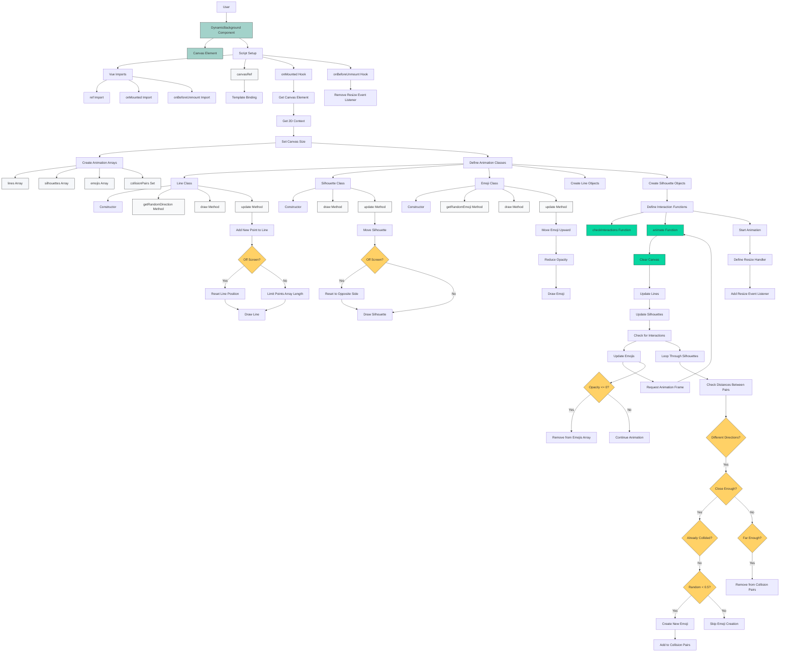
```mermaid
graph TD
    %% Main Component
    User[User] --> DynamicBackground[DynamicBackground Component]
    
    %% Component Structure
    DynamicBackground --> CanvasElement[Canvas Element]
    DynamicBackground --> ScriptSetup[Script Setup]
    
    %% Script Setup
    ScriptSetup --> VueImports[Vue Imports]
    VueImports --> RefImport[ref Import]
    VueImports --> OnMountedImport[onMounted Import]
    VueImports --> OnBeforeUnmountImport[onBeforeUnmount Import]
    
    %% Canvas Reference
    ScriptSetup --> CanvasRef[canvasRef]
    CanvasRef --> TemplateBinding[Template Binding]
    
    %% Lifecycle Hooks
    ScriptSetup --> MountedHook[onMounted Hook]
    ScriptSetup --> UnmountHook[onBeforeUnmount Hook]
    
    %% Canvas Initialization
    MountedHook --> GetCanvas[Get Canvas Element]
    GetCanvas --> GetContext[Get 2D Context]
    GetContext --> SetCanvasSize[Set Canvas Size]
    
    %% Animation Elements
    SetCanvasSize --> CreateArrays[Create Animation Arrays]
    CreateArrays --> LinesArray[lines Array]
    CreateArrays --> SilhouettesArray[silhouettes Array]
    CreateArrays --> EmojisArray[emojis Array]
    CreateArrays --> CollisionPairsSet[collisionPairs Set]
    
    %% Classes
    SetCanvasSize --> DefineClasses[Define Animation Classes]
    DefineClasses --> LineClass[Line Class]
    DefineClasses --> SilhouetteClass[Silhouette Class]
    DefineClasses --> EmojiClass[Emoji Class]
    
    %% Line Class
    LineClass --> LineConstructor[Constructor]
    LineClass --> GetRandomDirection[getRandomDirection Method]
    LineClass --> DrawLine[draw Method]
    LineClass --> UpdateLine[update Method]
    
    %% Silhouette Class
    SilhouetteClass --> SilhouetteConstructor[Constructor]
    SilhouetteClass --> DrawSilhouette[draw Method]
    SilhouetteClass --> UpdateSilhouette[update Method]
    
    %% Emoji Class
    EmojiClass --> EmojiConstructor[Constructor]
    EmojiClass --> GetRandomEmoji[getRandomEmoji Method]
    EmojiClass --> DrawEmoji[draw Method]
    EmojiClass --> UpdateEmoji[update Method]
    
    %% Initialize Objects
    DefineClasses --> CreateLines[Create Line Objects]
    DefineClasses --> CreateSilhouettes[Create Silhouette Objects]
    
    %% Interaction Functions
    CreateSilhouettes --> DefineInteractions[Define Interaction Functions]
    DefineInteractions --> CheckInteractions[checkInteractions Function]
    
    %% Animation Loop
    DefineInteractions --> AnimateFunction[animate Function]
    AnimateFunction --> ClearCanvas[Clear Canvas]
    ClearCanvas --> UpdateLines[Update Lines]
    UpdateLines --> UpdateSilhouettes[Update Silhouettes]
    UpdateSilhouettes --> CheckForInteractions[Check for Interactions]
    CheckForInteractions --> UpdateEmojis[Update Emojis]
    UpdateEmojis --> RequestNextFrame[Request Animation Frame]
    RequestNextFrame --> AnimateFunction
    
    %% Start Animation
    DefineInteractions --> StartAnimation[Start Animation]
    
    %% Window Resize Handling
    StartAnimation --> DefineResizeHandler[Define Resize Handler]
    DefineResizeHandler --> AddResizeListener[Add Resize Event Listener]
    
    %% Cleanup
    UnmountHook --> RemoveResizeListener[Remove Resize Event Listener]
    
    %% Line Class Behavior
    UpdateLine --> AddNewPoint[Add New Point to Line]
    AddNewPoint --> CheckBoundaries{Off Screen?}
    CheckBoundaries -->|Yes| ResetLine[Reset Line Position]
    CheckBoundaries -->|No| LimitPoints[Limit Points Array Length]
    ResetLine --> DrawLineShape[Draw Line]
    LimitPoints --> DrawLineShape
    
    %% Silhouette Class Behavior
    UpdateSilhouette --> MoveSilhouette[Move Silhouette]
    MoveSilhouette --> CheckSilhouetteBounds{Off Screen?}
    CheckSilhouetteBounds -->|Yes| ResetSilhouette[Reset to Opposite Side]
    CheckSilhouetteBounds -->|No| DrawSilhouetteShape[Draw Silhouette]
    ResetSilhouette --> DrawSilhouetteShape
    
    %% Emoji Class Behavior
    UpdateEmoji --> MoveEmojiUp[Move Emoji Upward]
    MoveEmojiUp --> ReduceOpacity[Reduce Opacity]
    ReduceOpacity --> DrawEmojiShape[Draw Emoji]
    
    %% Interaction Logic
    CheckForInteractions --> LoopSilhouettes[Loop Through Silhouettes]
    LoopSilhouettes --> CheckDistances[Check Distances Between Pairs]
    CheckDistances --> DirectionCheck{Different Directions?}
    DirectionCheck -->|Yes| ProximityCheck{Close Enough?}
    ProximityCheck -->|Yes| CollisionCheck{Already Collided?}
    CollisionCheck -->|No| RandomChance{Random < 0.5?}
    RandomChance -->|Yes| CreateEmoji[Create New Emoji]
    RandomChance -->|No| SkipEmoji[Skip Emoji Creation]
    CreateEmoji --> AddToPairs[Add to Collision Pairs]
    ProximityCheck -->|No| FarCheck{Far Enough?}
    FarCheck -->|Yes| RemoveFromPairs[Remove from Collision Pairs]
    
    %% Emoji Management
    UpdateEmojis --> CheckEmojiOpacity{Opacity <= 0?}
    CheckEmojiOpacity -->|Yes| RemoveEmoji[Remove from Emojis Array]
    CheckEmojiOpacity -->|No| ContinueAnimation[Continue Animation]
    
    %% Styling
    classDef component fill:#a3d2ca,stroke:#333,stroke-width:1px;
    classDef element fill:#f5f7fa,stroke:#333,stroke-width:1px;
    classDef method fill:#f8f9fa,stroke:#333,stroke-width:1px;
    classDef function fill:#06d6a0,stroke:#333,stroke-width:1px;
    classDef conditional fill:#ffd166,stroke:#333,stroke-width:1px;
    
    class DynamicBackground,CanvasElement component;
    class CanvasRef,LinesArray,SilhouettesArray,EmojisArray,CollisionPairsSet element;
    class GetRandomDirection,DrawLine,UpdateLine,DrawSilhouette,UpdateSilhouette,GetRandomEmoji,DrawEmoji,UpdateEmoji method;
    class CheckInteractions,AnimateFunction,ClearCanvas function;
    class CheckBoundaries,CheckSilhouetteBounds,DirectionCheck,ProximityCheck,CollisionCheck,RandomChance,FarCheck,CheckEmojiOpacity conditional;
```

## License

Distributed under the Creative Commons Attribution-NonCommercial-NoDerivs (CC BY-NC-ND) license. See LICENSE for more information.

## Attribution

### Creation

Modo was written, developed and deployed entirely by [Gabriel Ong](https://gabrielongzm.com/).

<table>
	<tbody>
        <tr>
            <td align="center">
                <a href="https://www.linkedin.com/in/gabriel-zmong/">
                    
                    <br />
                    <sub><b>Gabriel Ong</b></sub>
                </a>
            </td>
        </tr>
	</tbody>
</table>

### Testing

My thanks also go out to these beta-testers who helped stress test Modo. 

<table>
	<tbody>
        <tr>
            <td align="center">
                <a href="https://github.com/a-stint">
                    
                    <br />
                    <sub><b>Astin Tay</b></sub>
                </a>
            </td> 
            <td align="center">
                <a href="https://github.com/kybuno">
                    
                    <br />
                    <sub><b>Nichole Bun</b></sub>
                </a>
            </td>
            <td align="center">
                <a href="https://github.com/kevanwee">
                    
                    <br />
                    <sub><b>Kevan Wee</b></sub>
                </a>
            </td>
        </tr>
	</tbody>
</table>

## Support

Report any issues [here](https://github.com/gongahkia/modo-app/issues).

## Reference

The name `Modo` is in reference to [Modal Soul](https://en.wikipedia.org/wiki/Modal_Soul), the second album produced by legendary Japanese hip-hop artist 瀬葉 淳 (Jun Seba), better known by his stage name [Nujabes](https://en.wikipedia.org/wiki/Nujabes). 


