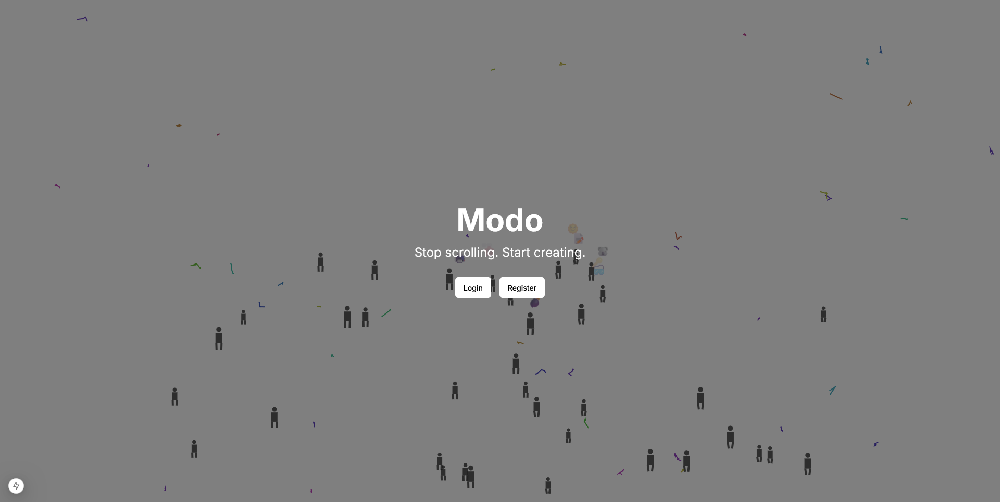
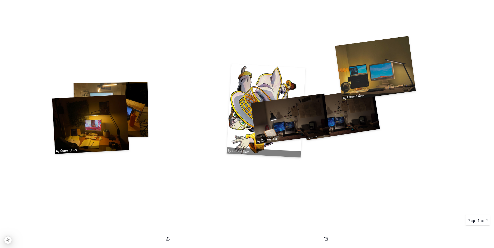
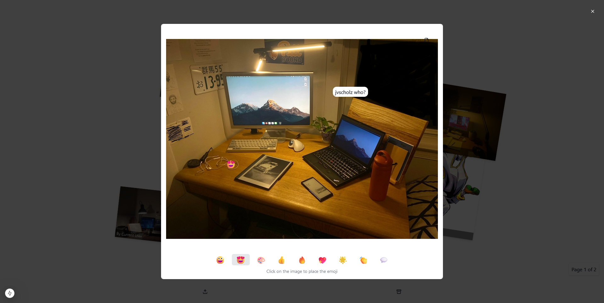
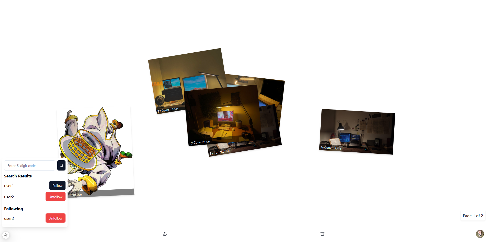
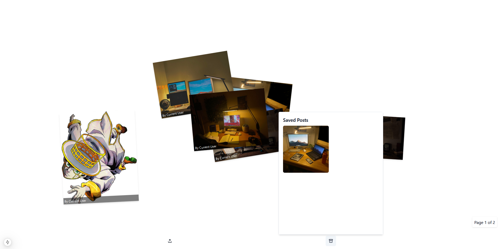
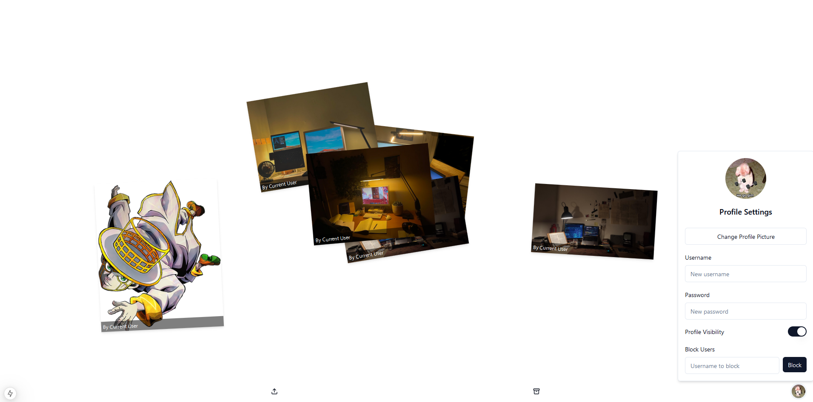

> [!NOTE]  
> Still in development.  

# `Modo` 🖌️

Social media web app for artists.

## Rationale

> TODO add more here

## Screenshots

## Usage

`Modo` is ***now live*** at [https://modo-live.vercel.app/](https://modo-live.vercel.app/).

## Support

> TODO add here

## Architecture

> TODO add more and a diagram here showing all the microservices used

## Disclaimer

> TODO add legal disclaimer here

## License

> TODO add license here similar to this one 

## Beta Testers

My thanks to the following people for their patience and feedback.

<table>
	<tbody>
        <tr>
            <td align="center">
                <a href="https://www.linkedin.com/in/nicholebun/">
                    
                     
                    <b>Nichole Bun</b>
                </a>
            </td>
            <td align="center">
		<a href="https://github.com/a-stint">
                    
                     
                    <b>Astin Tay</b>
                </a>
            </td>
        </tr>
	<tbody>
</table>

## Reference

The name `Modo` is in reference to [Modal Soul](https://en.wikipedia.org/wiki/Modal_Soul), the second album produced by legendary Japanese hip-hop artist 瀬葉 淳 (Jun Seba), better known by his stage name [Nujabes](https://en.wikipedia.org/wiki/Nujabes). 

