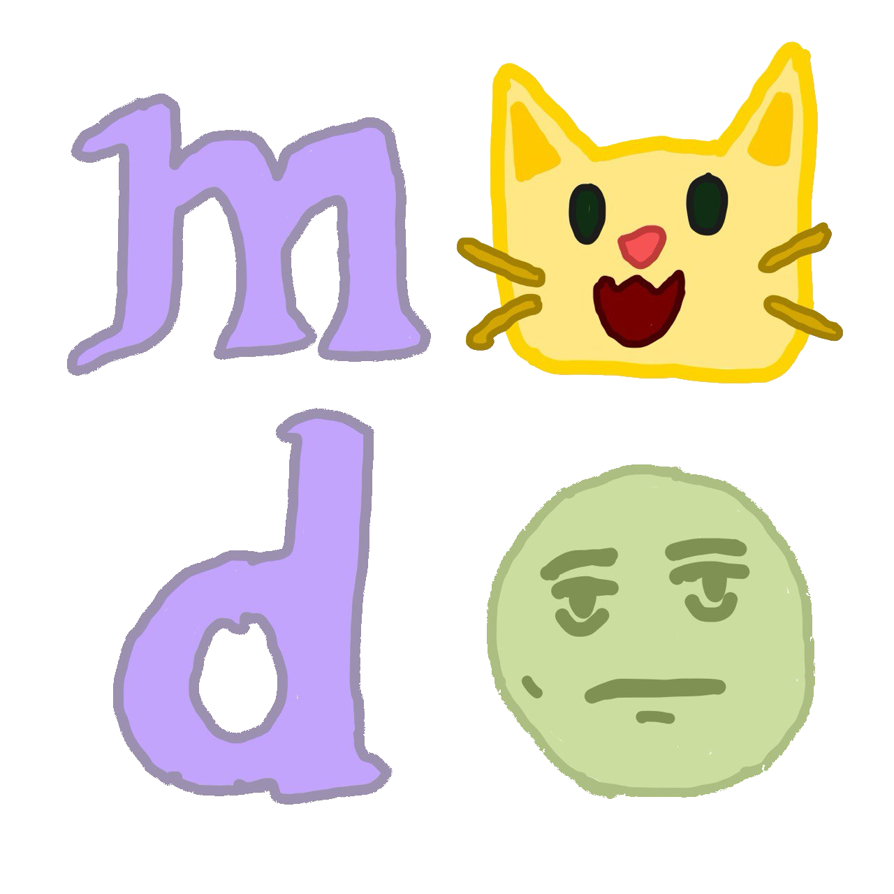

[](https://github.com/gongahkia/modo-app/releases/tag/1.0.0)


# `Modo` 🖌️

<p align="center">

</p>

Modo is a social media app for artists.

Currently served as a web app at [https://modo-live.vercel.app/](https://modo-live.vercel.app/).

## Rationale

...

## Screenshots

...

## Support

...

## Architecture

### DB

```mermaid
```

### Overview

```mermaid
```

## Disclaimer

> TODO add legal disclaimer here

## License

> Add license here similar to the one Zeming posted in his repo ...

## Reference

The name `Modo` is in reference to [Modal Soul](https://en.wikipedia.org/wiki/Modal_Soul), the second album produced by legendary Japanese hip-hop artist 瀬葉 淳 (Jun Seba), better known by his stage name [Nujabes](https://en.wikipedia.org/wiki/Nujabes). 


