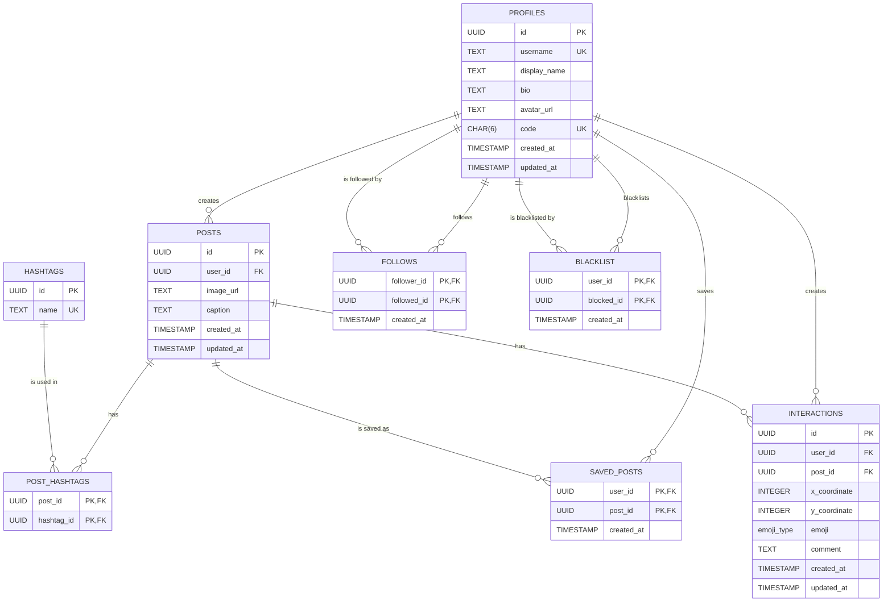

# DB details 

Currently hosted on Supabase.

## Architecture 

## Overview

### PROFILES
* Stores user profile information
* Primary Key: `id` (UUID)
* Unique constraints: `username`, `code`

### POSTS
* Stores user posts
* Primary Key: `id` (UUID)
* Foreign Key: `user_id` references PROFILES(id)

### HASHTAGS
* Stores unique hashtags
* Primary Key: `id` (UUID)
* Unique constraint: `name`

### POST_HASHTAGS
* Junction table linking posts to hashtags
* Composite Primary Key: (`post_id`, `hashtag_id`)
* Foreign Keys: `post_id` references POSTS(id), `hashtag_id` references HASHTAGS(id)

### FOLLOWS
* Represents follower relationships between users
* Composite Primary Key: (`follower_id`, `followed_id`)
* Foreign Keys: Both `follower_id` and `followed_id` reference PROFILES(id)

### BLACKLIST
* Represents blocked user relationships
* Composite Primary Key: (`user_id`, `blocked_id`)
* Foreign Keys: Both `user_id` and `blocked_id` reference PROFILES(id)

### SAVED_POSTS
* Represents posts saved by users
* Composite Primary Key: (`user_id`, `post_id`)
* Foreign Keys: `user_id` references PROFILES(id), `post_id` references POSTS(id)

### INTERACTIONS
* Stores user interactions with posts (emoji reactions and comments)
* Primary Key: `id` (UUID)
* Foreign Keys: `user_id` references PROFILES(id), `post_id` references POSTS(id)

## Key Relationships
* A user (PROFILE) can create multiple POSTS
* A user can follow multiple users and be followed by multiple users (FOLLOWS)
* A user can blacklist multiple users and be blacklisted by multiple users (BLACKLIST)
* A user can save multiple posts (SAVED_POSTS)
* A post can have multiple hashtags (POST_HASHTAGS)
* A post can have multiple interactions (INTERACTIONS)

## Enum Types
* `emoji_type`: Defines the allowed emoji reactions ('❤️', '😂', '😮', '😢', '😡', '👍')

## Indexes
* `idx_posts_user_id` on POSTS(user_id)
* `idx_post_hashtags_post_id` on POST_HASHTAGS(post_id)
* `idx_post_hashtags_hashtag_id` on POST_HASHTAGS(hashtag_id)
* `idx_follows_follower_id` on FOLLOWS(follower_id)
* `idx_follows_followed_id` on FOLLOWS(followed_id)
* `idx_blacklist_user_id` on BLACKLIST(user_id)
* `idx_saved_posts_user_id` on SAVED_POSTS(user_id)
* `idx_interactions_post_id` on INTERACTIONS(post_id)

## Row Level Security (RLS)
RLS is enabled on all tables with policies to ensure data privacy and security. Key policies include:
* Users can view all profiles but only update their own
* Users can read posts of people they follow and their own
* Users can manage their own follows, blacklist, and saved posts
* Users can read interactions on posts they can see and manage their own interactions

## Triggers
* `update_profiles_modtime`: Updates the `updated_at` timestamp on PROFILES
* `update_posts_modtime`: Updates the `updated_at` timestamp on POSTS
* `update_interactions_modtime`: Updates the `updated_at` timestamp on INTERACTIONS
